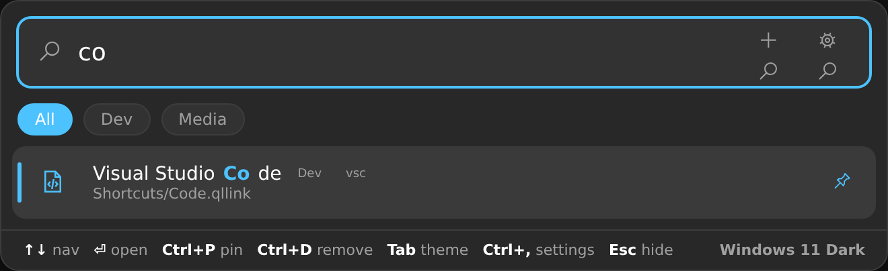

<div align="center">

# 🚀 PyDoc V1.0 Stable

### A Flow-Launcher-style quick app launcher with a real **Windows 11 Fluent UI** — powered by Python.


**Stable 1.0.0 Released!!!**


<br />

[](https://www.python.org/)
[](https://github.com/virtualvivek/windows-ui)
[](https://pywebview.flowrl.com/)
[](#-platform-support)
[](#-license)
[](#-contributing)

<br />

**Press a hotkey → search → launch.** Drag-and-drop to add. Themeable. One folder. Zero clutter.

[Features](#-features) · [Install](#-installation) · [Usage](#-usage) · [Icons](#-icon-system) · [Keybinds](#-keybinds) · [Build .exe](#-build-a-standalone-exe) · [Architecture](#-architecture)

</div>

---

## ✨ Features

<table>
<tr>
<td width="50%" valign="top">

#### 🎨 Looks & feel
- Genuine **Windows 11 Fluent UI** ([`windows-ui-fabric`](https://github.com/virtualvivek/windows-ui))
- Rounded **acrylic/Mica** card + accent selection bar
- Smooth **pop / fade** animations
- **6 themes** (Win 11 Dark/Light, Midnight, Nord, Mint, Sunset) — live switch with `Tab`
- **Fuzzy-match highlighting** in results

#### 🔎 Search that gets out of the way
- Fuzzy search with prefix/exact boosts
- **Usage ranking** — frequent & recent float to top
- **Inline calculator** — `23*7+1`, `sqrt(144)`, `50%`, `(1+2)^3`
- **Web search / open-URL** built in

</td>
<td width="50%" valign="top">

#### 🗂 Organise your way
- **One folder only** — `Shortcuts/` + `shortcuts.json`
- **Drag-and-drop** files / folders / links to add
- **Pins**, **groups**, **aliases**
- Flexible **icon system** (Fluent / Material / file / emoji / default)

#### ⚡ Power features
- **System-tray icon** (Open · Reload · Folder · Quit)
- **Global hotkeys** + **per-shortcut hotkeys**
- **Custom keybind recorder** (default add = `Ctrl+Win+N`)
- **Auto-start on Windows login**
- In-app **Settings & shortcut editor**
- **PyInstaller** build + install/uninstall scripts

</td>
</tr>
</table>

---

## 📦 Installation

```bash
git clone https://github.com/compromisee/PyDoc.git
cd PyDoc
pip install -r requirements.txt      # pywebview (required) + tray/hotkey extras
python launcher.py
```

> **Windows:** double-click **`Run PyDoc.bat`** (installs deps on first run,
> launches with `pythonw` so there's no console window). pywebview uses the built-in
> **Edge WebView2** runtime shipped with Windows 10/11.

### Optional extras
| Package | Unlocks |
|---|---|
| `pywebview` | **Required** — the native Fluent window |
| `keyboard` | Global `Alt+Space` + `Ctrl+Win+N` + per-shortcut hotkeys |
| `pystray` + `pillow` | System-tray icon |
| `pyinstaller` | Build a standalone `.exe` |

The app degrades gracefully — without `keyboard`/`pystray` everything else still works.

### One-click Windows setup
```bat
install.cmd      :: installs deps, registers auto-start, adds a Start Menu shortcut
uninstall.cmd    :: stops it, removes the auto-start entry + Start Menu shortcut
```

---

## 🚀 Usage

1. Launch it (or press **`Alt+Space`**).
2. Type to search apps, shortcuts, math, or the web.
3. `↑ ↓` to move, **`Enter`** to open.
4. **Drag any file/folder/link onto the window** to add it as a shortcut.
5. Press **`Ctrl+Win+N`** (or the **+** button) to add one manually.
6. Select a shortcut and press **`Ctrl+D`** to remove it.

### The “one folder” rule
PyDoc only ever lists:
- files inside the **`Shortcuts/`** folder (`.lnk`, `.exe`, `.url`, docs, folders, `.qllink`)
- custom entries in **`shortcuts.json`**

Dropped items are saved as a tiny **`.qllink`** JSON file in `Shortcuts/`:
```json
{ "name": "Figma", "target": "https://figma.com", "icon": "🎨", "image": "winui:edit" }
```
Delete the file (or press `Ctrl+D`) to remove the shortcut.

---

## 🎨 Icon system

Pick an icon for any shortcut from the **icon picker** (click the icon tile in the Add/Edit form):

| Source | How |
|---|---|
| **Default** | Auto-guessed emoji from the file type / URL |
| **Fluent** | Search 239 bundled `windows-ui` icons (offline) |
| **Material** | Type a [Google Material](https://fonts.google.com/icons) name (`rocket_launch`) — downloaded & cached to `Icons/` |
| **Emoji** | Paste any emoji, or pick from quick-picks |
| **File** | Choose your own `.ico` / `.svg` / `.png` (copied into `Icons/`) |

---

## ⌨️ Keybinds

All global hotkeys are editable in **Settings → Keybinds** with a click-to-record control.

| Action | Default | Scope |
|---|---|---|
| Toggle launcher | `Alt+Space` | Global |
| Add new shortcut | `Ctrl+Win+N` | Global |
| Per-shortcut launch | *(your choice)* | Global |
| Move selection | `↑ / ↓` · `PgUp/PgDn` | In-app |
| Open selected | `Enter` | In-app |
| Open Shortcuts folder | `Ctrl+Enter` | In-app |
| Pin / unpin | `Ctrl+P` | In-app |
| Remove shortcut | `Ctrl+D` (or `Del` when search is empty) | In-app |
| Next theme | `Tab` | In-app |
| Settings | `Ctrl+,` | In-app |
| Hide | `Esc` | In-app |

---

## 🔌 Auto-start on Windows login

Toggle **“Start automatically on Windows login”** in Settings, or run `install.cmd`.
It writes a `PyDoc` value to:
```
HKCU\Software\Microsoft\Windows\CurrentVersion\Run
```
launching with `pythonw.exe` at sign-in. Remove it with the toggle or `uninstall.cmd`.

---

## 🏗 Build a standalone .exe

```bash
pip install pyinstaller
python build.py            # → dist/PyDoc.exe  (single file, no console)
python build.py --onedir   # folder build (faster startup)
python build.py --console  # keep a console for debugging
```
The web UI, vendored Fluent assets and themes are bundled into the executable.
Drop an `Icons/app.ico` before building to brand the `.exe`.

---

## 🧱 Architecture

```
PyDoc/
├── launcher.py            # pywebview host: window, tray, hotkeys, drag-drop, JS-API bridge
├── core.py                # all logic (scan, search, calc, icons, autostart, store) — headless-testable
├── build.py               # PyInstaller packaging
├── install.cmd            # register auto-start + Start Menu shortcut
├── uninstall.cmd          # remove them again
├── Run PyDoc.bat  # Windows double-click launcher
├── requirements.txt
├── web/
│   ├── index.html         # Fluent UI markup (windows-ui-fabric classes)
│   ├── app.css            # Win 11 skin + theme variables
│   ├── app.js             # front-end logic, talks to Python via pywebview.api
│   └── vendor/            # bundled windows-ui-fabric (CSS/JS) + 239 winui icons
├── Shortcuts/             # ← the ONE folder (drop files / .qllink here)
├── Icons/                 # downloaded Material + imported custom icons (auto)
├── config.json            # settings            (auto-created)
├── themes.json            # theme accent + mode (auto-created)
├── shortcuts.json         # custom entries      (auto-created)
└── store.json             # usage + metadata: pins/groups/aliases/hotkeys/icons (auto)
```

**Bridge:** `app.js` calls `window.pywebview.api.<method>()` → methods on the `Api`
class in `launcher.py` → logic in `core.py`. Opening `web/index.html` in a plain
browser falls back to a built-in **mock** so the UI can be designed without Python.

---

## ⚙️ Configuration — `config.json`

```json
{
  "theme": "Windows 11 Dark",
  "hotkey": "ctrl+windows+n",
  "hotkey_add": "ctrl+windows+a",
  "show_path_subtext": true,
  "autostart": false,
  "show_on_launch": true,
  "max_results": 9,
  "enable_calculator": true,
  "enable_websearch": true,
  "web_search_url": "https://www.google.com/search?q={q}",
  "material_cdn": "https://cdn.jsdelivr.net/npm/@material-icons/svg/svg/{name}/baseline.svg"
}
```

### Themes — `themes.json`
```json
{
  "Windows 11 Dark":  { "mode": "dark",  "primary": "#4cc2ff" },
  "Windows 11 Light": { "mode": "light", "primary": "#0067c0" }
}
```
Add your own — they appear in the picker automatically.

---

## 💻 Platform support

| Platform | Window | Tray | Hotkeys | Auto-start |
|---|:--:|:--:|:--:|:--:|
| **Windows 10/11** | ✅ WebView2 | ✅ | ✅ | ✅ (Run key) |
| **macOS** | ✅ (cocoa) | ✅ | ⚠️ needs accessibility perms | ➖ |
| **Linux** | ✅ (GTK/Qt) | ✅ | ⚠️ may need root for `keyboard` | ➖ |

---

## 🐛 Troubleshooting

- **No window appears** → install pywebview: `pip install pywebview`. On Linux add `[qt]` or `[gtk]`.
- **Hotkeys don't fire** → `pip install keyboard` (Linux may need to run with sufficient privileges).
- **No tray icon** → `pip install pystray pillow`.
- **Material icon won't fetch** → check internet; names are snake_case from fonts.google.com/icons.

---

## 🤝 Contributing

Issues and PRs welcome! Ideas: more themes, indexed Start-Menu apps, plugin actions, clipboard history.

---

## 📜 Credits & License

- UI framework: **[windows-ui (windows-ui-fabric)](https://github.com/virtualvivek/windows-ui)** by
  [@virtualvivek](https://github.com/virtualvivek) — MIT. Its `dist` CSS/JS + the
  companion icon font are vendored in `web/vendor/`.
- Native window: **[pywebview](https://pywebview.flowrl.com/)**.
- Material icons: **[Google Material Icons](https://fonts.google.com/icons)**.

Released under the **MIT License**.
